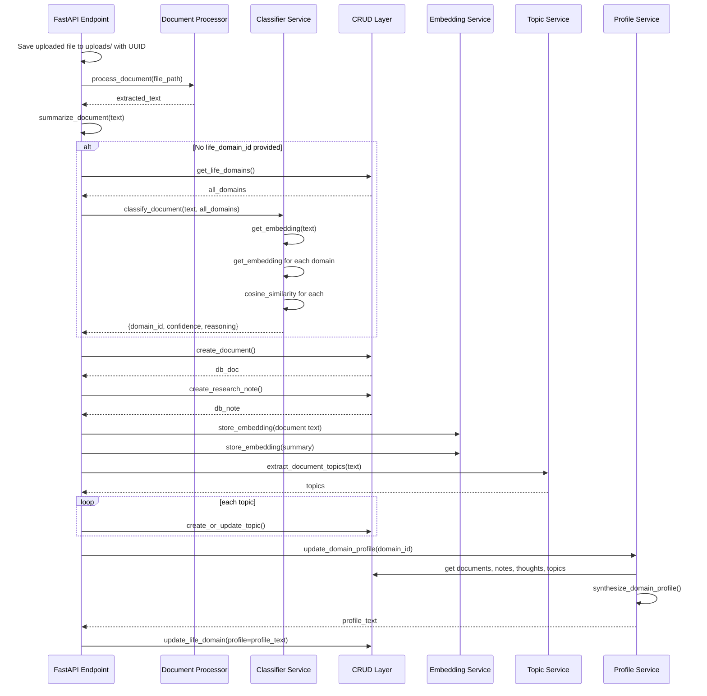
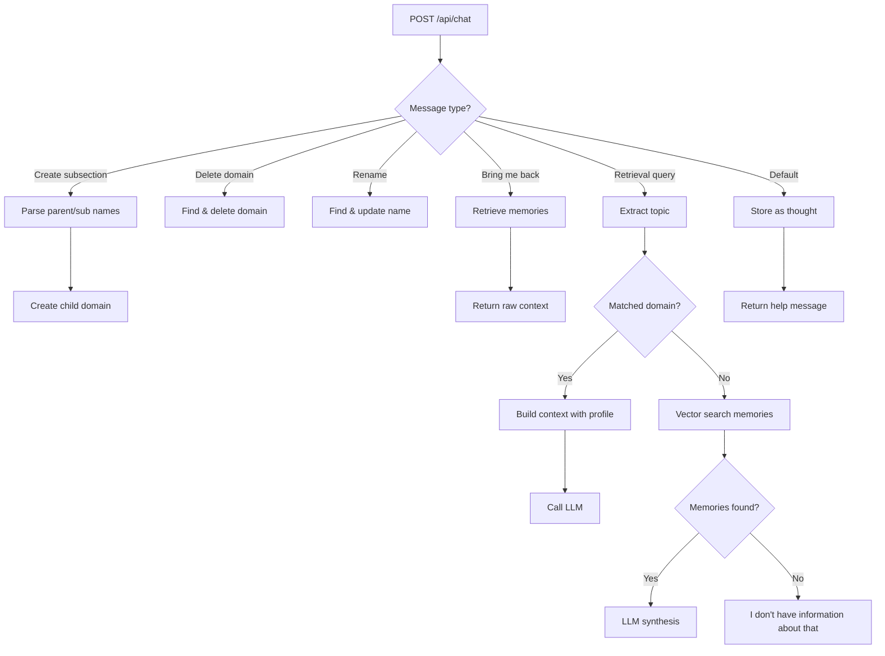

# Sage API Documentation

> **Purpose:** Document every API endpoint in Sage. For each endpoint: purpose, request, response, validation, error handling, and internal execution flow.

---

## Table of Endpoints

1. [Life Domains](#life-domains)
2. [Thoughts](#thoughts)
3. [Documents](#documents)
4. [Research Notes](#research-notes)
5. [Topics](#topics)
6. [Deadlines](#deadlines)
7. [Daily Plans](#daily-plans)
8. [Chat](#chat)
9. [Retrieval](#retrieval)
10. [User](#user)
11. [Domain Documents](#domain-documents)
12. [Seeding](#seeding)

---

## Base URL

Development: `http://localhost:8000`

All endpoints are prefixed with `/api`.

---

## Life Domains

Life domains are the foundational organizational unit of Sage. They represent projects, life areas, knowledge domains, and system components. Each domain belongs to one of four layers: `life`, `project`, `knowledge`, or `system`.

### `POST /api/life-domains`

**Purpose:** Create a new life domain.

**Request Body (JSON):**
```json
{
  "name": "ReRoot",
  "description": "Social enterprise about agency",
  "layer": "project",
  "parent_id": null
}
```

**Validation:**
- `name`: Required, string, 1-255 characters.
- `layer`: Must be one of `life`, `project`, `knowledge`, `system`.

**Response (201):**
```json
{
  "id": "uuid-string",
  "name": "ReRoot",
  "description": "Social enterprise about agency",
  "layer": "project",
  "status": "active",
  "parent_id": null,
  "profile": null,
  "created_at": "2026-07-09T10:00:00",
  "updated_at": "2026-07-09T10:00:00"
}
```

**Error Handling:**
- `422 Unprocessable Entity`: Validation error (e.g., empty name).

**Internal Flow:**
1. Validate request body against `LifeDomainCreate` schema.
2. Call `crud.create_life_domain()` to insert into SQLite.
3. Return the created domain with generated UUID and timestamps.

---

### `GET /api/life-domains`

**Purpose:** List all life domains, optionally filtered by layer.

**Query Parameters:**
- `layer` (optional): Filter by layer (`life`, `project`, `knowledge`, `system`).
- `skip` (optional): Pagination offset (default: 0).
- `limit` (optional): Max results (default: 100).

**Response (200):**
```json
[
  {
    "id": "uuid-string",
    "name": "Self",
    "description": "Physical, mental, emotional well-being",
    "layer": "life",
    "status": "active",
    "parent_id": null,
    "profile": "Synthesized understanding...",
    "created_at": "2026-07-09T10:00:00",
    "updated_at": "2026-07-09T10:00:00"
  }
]
```

**Internal Flow:**
1. Parse query parameters.
2. Call `crud.get_life_domains()` with optional layer filter.
3. Order by `updated_at DESC` (most recently updated first).

---

### `GET /api/life-domains/{domain_id}`

**Purpose:** Get a single life domain by ID.

**Path Parameter:**
- `domain_id`: UUID string.

**Response (200):** Single `LifeDomain` object.

**Error Handling:**
- `404 Not Found`: Domain does not exist.

**Internal Flow:**
1. Call `crud.get_life_domain()`.
2. If None, raise `HTTPException(status_code=404)`.

---

### `PUT /api/life-domains/{domain_id}`

**Purpose:** Update a life domain's fields.

**Request Body:** Partial JSON object with fields to update.

**Example:**
```json
{"name": "ReRoot Foundation", "description": "Updated description"}
```

**Response (200):** Updated `LifeDomain` object.

**Error Handling:**
- `404 Not Found`: Domain does not exist.

---

### `DELETE /api/life-domains/{domain_id}`

**Purpose:** Delete a life domain and all associated data (thoughts, documents, notes) via cascade.

**Response (200):**
```json
{"message": "Life domain deleted"}
```

**Error Handling:**
- `404 Not Found`: Domain does not exist.

---

### `POST /api/life-domains/{domain_id}/subsections`

**Purpose:** Create a subsection (child domain) under an existing domain.

**Request Body (form-data):**
- `name`: Subsection name.
- `description`: Subsection description.

**Response (200):** Created `LifeDomain` with `parent_id` set.

**Internal Flow:**
1. Look up parent domain.
2. Create child domain with `parent_id = domain_id`.
3. Name is formatted as `{Parent} / {Child}`.

---

## Thoughts

Thoughts are user-generated insights, ideas, or observations attached to a specific life domain.

### `POST /api/thoughts`

**Purpose:** Create a new thought.

**Request Body:**
```json
{
  "life_domain_id": "uuid-string",
  "content": "Idea: Use transformers for temporal understanding in Kaal.",
  "source": "user_chat"
}
```

**Internal Execution Flow:**
1. Validate `ThoughtCreate` schema.
2. Call `crud.create_thought()` to store in SQLite.
3. Call `store_embedding()` to create a vector embedding of the thought.
4. Store in ChromaDB with metadata: `{type: "thought", life_domain_id, source}`.

**Response (201):** `Thought` object.

---

### `GET /api/life-domains/{domain_id}/thoughts`

**Purpose:** Get all thoughts for a specific life domain.

**Response (200):** List of `Thought` objects, ordered by `created_at DESC`.

---

## Documents

Documents are uploaded files (PDF, DOCX, TXT, MD) attached to a life domain.

### `POST /api/documents/upload`

**Purpose:** Upload a document, extract text, classify, summarize, embed, and store.

**Request Body (multipart/form-data):**
- `file`: The uploaded file.
- `life_domain_id` (optional): Target domain. If not provided, auto-classification is attempted.

**Response (200):**
```json
{
  "document_id": "uuid-string",
  "note_id": "uuid-string",
  "filename": "pitch-deck.pdf",
  "summary": "Document Summary (450 words)\n======================\nKey Topics:\n- Revenue Model\n- Team\nOverview:\nA social enterprise focused on...",
  "assigned_domain": "Sage",
  "extracted_topics": [
    {"name": "Revenue Model", "frequency": 1},
    {"name": "Team Structure", "frequency": 1}
  ],
  "content_preview": "A social enterprise focused on..."
}
```

**Internal Execution Flow:**
This is the most complex endpoint in Sage. Here is the complete flow:



**Validation:**
- File must be provided.
- Supported extensions: `.pdf`, `.docx`, `.txt`, `.md`.

**Error Handling:**
- `422`: Missing file or invalid file type.
- `500`: Extraction or processing errors (caught internally, logged).

---

### `GET /api/life-domains/{domain_id}/documents`

**Purpose:** Get all documents for a specific life domain.

**Response (200):** List of `Document` objects.

---

## Research Notes

Research notes are structured summaries and insights derived from documents or user input.

### `POST /api/research/notes`

**Purpose:** Create a research note.

**Request Body:**
```json
{
  "life_domain_id": "uuid-string",
  "title": "Insights from Jordan Peterson on Responsibility",
  "content": "Responsibility is the price of meaning...",
  "source": "12 Rules for Life",
  "source_author": "Jordan Peterson",
  "tags": ["psychology", "meaning", "responsibility"]
}
```

**Internal Flow:**
1. Store in SQLite via `crud.create_research_note()`.
2. Generate embedding and store in ChromaDB with metadata.

**Response (201):** `ResearchNote` object.

---

### `GET /api/research/notes`

**Purpose:** List research notes, optionally filtered by life domain.

**Query Parameters:**
- `life_domain_id` (optional)

**Response (200):** List of `ResearchNote` objects.

---

## Topics

Topics are automatically extracted themes from documents and conversations.

### `GET /api/topics`

**Purpose:** Get all topics across all domains.

**Response (200):**
```json
{
  "topics": [
    {"id": "uuid", "name": "Revenue Model", "frequency": 3, "life_domain_id": "uuid"}
  ],
  "count": 42
}
```

---

### `GET /api/life-domains/{domain_id}/topics`

**Purpose:** Get topics for a specific domain.

**Response (200):** Same format as above, filtered by domain.

---

## Deadlines

Deadlines track tasks with due dates and statuses.

### `POST /api/deadlines`

**Purpose:** Create a deadline.

**Request Body:**
```json
{
  "life_domain_id": "uuid-string",
  "title": "Submit SIA Fellowship Application",
  "description": "Complete all required fields",
  "due_date": "2026-08-15T23:59:00",
  "priority": "high",
  "reminder_days": [14, 7, 3, 1]
}
```

**Validation:**
- `title`: Required, min length 1.
- `due_date`: ISO 8601 datetime.
- `priority`: Defaults to `medium`.

**Response (201):** `Deadline` object.

---

### `GET /api/deadlines`

**Purpose:** List deadlines, optionally filtered by domain and status.

**Query Parameters:**
- `life_domain_id` (optional)
- `status` (optional): `not_started`, `in_progress`, `completed`

**Response (200):** List of `Deadline` objects, ordered by due date.

---

## Daily Plans

Daily plans track focus areas and tasks for a specific day.

### `POST /api/plans`

**Purpose:** Create a daily plan.

**Request Body:**
```json
{
  "life_domain_id": "uuid-string",
  "date": "2026-07-09T00:00:00",
  "focus_areas": ["Sage architecture", "Interview prep"],
  "tasks": [
    {"title": "Write system design doc", "completed": false},
    {"title": "Review RAG patterns", "completed": true}
  ],
  "notes": "Feeling focused today."
}
```

**Response (201):** `DailyPlan` object.

---

### `GET /api/plans`

**Purpose:** List daily plans, optionally filtered by domain.

**Response (200):** List of `DailyPlan` objects, ordered by date DESC.

---

## Chat

Chat is the primary user interaction interface in the MVP.

### `POST /api/chat`

**Purpose:** Send a message to Sage and receive a response.

**Request Body:**
```json
{
  "life_domain_id": "uuid-string",
  "message": "What do I know about Kaal?",
  "layer": "project"
}
```

**Validation:**
- `message`: Required, min length 1.
- `layer`: Optional, defaults to `general`.

**Response (200):**
```json
{
  "response": "Kaal is a temporal intelligence framework that uses Jyotish symbolism...",
  "conversation_id": null,
  "retrieved_memories": [
    {
      "id": "uuid",
      "content": "Kaal pitch deck mentions life phases and Jyotish symbolism...",
      "metadata": {"type": "document", "life_domain_id": "uuid"},
      "distance": 0.234
    }
  ]
}
```

**Internal Execution Flow:**
This is the most critical endpoint. Here is the complete logic:



**Command Detection:**
The endpoint detects several command patterns:
- `create subsection in [Domain] called [Name]`
- `delete domain [Name]`
- `rename [Old] to [New]`
- `bring me back` / `where was i`
- `what do i know about [topic]` / `tell me about [topic]` / `explain [topic]`

**Auto-Store Logic:**
If the message is not a command or query, it is automatically stored as a thought in the current domain (if selected) or general memory.

---

### `POST /api/chat/layer`

**Purpose:** Send a message to a specific conversation layer.

**Layers:** `general`, `life`, `project`, `knowledge`, `system`

**Request Body:**
```json
{
  "message": "How is Sage's architecture evolving?",
  "layer": "system"
}
```

**Internal Execution Flow:**
1. Store user message in `chat_messages` table with layer context.
2. Retrieve last 10 messages from the same layer for conversation history.
3. Detect "store this" commands and save previous messages as thoughts.
4. Assemble layer-specific context:
   - `general`: No domain bias.
   - `life`: Bias toward life domains (Self, Career, Finance).
   - `project`: Bias toward project domains, fetch domain document if matched.
   - `knowledge`: Bias toward knowledge domains (AI, Human Development).
   - `system`: Bias toward system domains (Memory, Tasks, Dashboard).
5. Call LLM with assembled context.
6. Store assistant response in chat history.
7. Auto-classify user message and store as thought + append to domain document.

**Document Auto-Append:**
Messages are appended to domain overview documents with semantic formatting:
- Vision/Mission statements -> `## Vision Update`
- Architecture/Design -> `## Architecture`
- Decisions -> `## Decision`
- Insights -> `## Insight`
- Questions -> `## Question`
- Tasks -> `## Action Item`
- General -> `## Note`

**Document Size Management:**
Documents are truncated to 15,000 characters, keeping the most recent entries.

---

### `GET /api/chat/layer/{layer}`

**Purpose:** Get conversation history for a specific layer.

**Path Parameter:**
- `layer`: One of `general`, `life`, `project`, `knowledge`, `system`.

**Query Parameter:**
- `limit`: Max messages (default: 50).

**Response (200):** List of `ChatMessageHistory` objects.

---

## Retrieval

### `POST /api/retrieve`

**Purpose:** Directly retrieve memories from the vector database without LLM generation.

**Request Body:**
```json
{
  "query": "revenue model for rural distribution",
  "life_domain_id": "uuid-string",
  "n_results": 10
}
```

**Validation:**
- `query`: Required, min length 1.
- `n_results`: Optional, defaults to 5.

**Response (200):**
```json
{
  "memories": [
    {
      "id": "uuid",
      "content": "ReRoot's revenue model needs a different approach to rural distribution...",
      "metadata": {"type": "thought", "life_domain_id": "uuid"},
      "distance": 0.156
    }
  ],
  "count": 5
}
```

**Internal Flow:**
1. Call `retrieve_memories()` with query, optional domain filter, and result count.
2. `retrieve_memories()` calls `query_embeddings()` in ChromaDB.
3. Format results into list of dictionaries.

---

## User

### `GET /api/user`

**Purpose:** Get or create the user profile.

**Response (200):**
```json
{"name": "Shubhi Katiyar", "created_at": "2026-07-09T10:00:00"}
```

**Internal Flow:**
- If no user exists, create one with default name "Shubhi Katiyar".
- Returns the first user found (single-user system).

---

### `PUT /api/user`

**Purpose:** Update the user's name.

**Request Body (form-data):**
- `name`: New name.

**Response (200):**
```json
{"name": "New Name", "message": "Updated name to New Name"}
```

---

### `GET /api/greet`

**Purpose:** Generate a personalized greeting based on time of day.

**Response (200):**
```json
{
  "greeting": "Hey Shubhi! Good morning. What are we building today?",
  "name": "Shubhi Katiyar",
  "time_of_day": "morning"
}
```

**Internal Flow:**
1. Get user profile.
2. Determine time of day (morning: 5-12, afternoon: 12-17, evening: 17-21, night: 21-5).
3. If LLM available, generate greeting via LLM with specific rules (max 12 words, casual, ask what they're working on).
4. If no LLM, select from pre-written greeting templates.

---

## Domain Documents

Domain documents are editable markdown documents attached to life domains. They serve as the primary knowledge source for the LLM.

### `GET /api/life-domains/{domain_id}/documents`

**Purpose:** Get all editable documents for a domain.

**Response (200):** List of `DomainDocument` objects.

---

### `POST /api/life-domains/{domain_id}/documents`

**Purpose:** Create or update an editable document for a domain.

**Request Body (form-data):**
- `title`: Document title.
- `content`: Markdown content.
- `doc_type`: Document type (`overview`, `notes`, `sources`, `timeline`).

**Response (200):** `DomainDocument` object.

---

### `GET /api/domain-documents/{doc_id}`

**Purpose:** Get a single document by ID.

**Response (200):** `DomainDocument` object.

**Error Handling:**
- `404`: Document not found.

---

### `PUT /api/domain-documents/{doc_id}`

**Purpose:** Update document content.

**Request Body (form-data):**
- `content`: New markdown content.

**Response (200):**
```json
{"id": "uuid", "title": "Sage Overview", "version": 3, "content_length": 12500}
```

**Internal Flow:**
1. Find document by ID.
2. Update content.
3. Increment version number.
4. Commit to database.

---

## Seeding

### `POST /api/seed`

**Purpose:** Create default life domains if they don't exist.

**Response (200):**
```json
{
  "seeded": 19,
  "domains": ["Self", "Career", "Sage", "Sage / Product", "Sage / Engineering", ...]
}
```

**Internal Flow:**
1. Define `DEFAULT_DOMAINS` array with nested children.
2. For each domain, check if a domain with that name already exists.
3. If not, create the domain and any children.
4. Return count and names of created domains.

**Default Domains:**
| Layer | Domains |
|-------|---------|
| life | Self, Career, Finance, Content Creation, Community, Speaking, Writing, Life Administration, Long-term Dreams |
| project | Sage, Kaal, Navgunjara Foundation, ReRoot, Future Projects |
| knowledge | AI, Human Development, Technology, Entrepreneurship, Philosophy, Systems Thinking, Research Library, Experiments |
| system | Memory, Tasks, Goals, Decision Log, Knowledge Graph, Dashboard |

**Note:** The Sage project domain has subdomains: Product, Engineering, Research, Business, Users.

---

## CORS Configuration

Sage allows cross-origin requests from:
- `http://localhost:5173`
- `http://localhost:5174`
- `http://localhost:5175`

```python
app.add_middleware(
    CORSMiddleware,
    allow_origins=['http://localhost:5173', 'http://localhost:5174', 'http://localhost:5175'],
    allow_credentials=True,
    allow_methods=['*'],
    allow_headers=['*'],
)
```

**Security Note:** In production, restrict `allow_origins` to the actual frontend domain(s).

---

## Error Handling Patterns

Sage uses a consistent error handling pattern:

1. **Validation errors:** Pydantic returns `422 Unprocessable Entity` automatically.
2. **Not found:** `HTTPException(status_code=404, detail='Resource not found')`.
3. **Internal errors:** Print to console (logging to be improved). Return generic `500` in production.
4. **LLM errors:** Caught internally. System falls back to fallback synthesizer.

---

*This document should be updated whenever new endpoints are added or existing ones change.*
