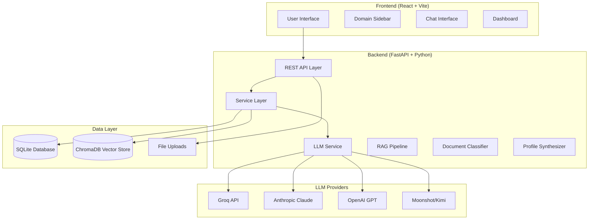
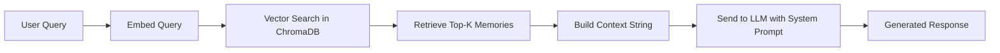
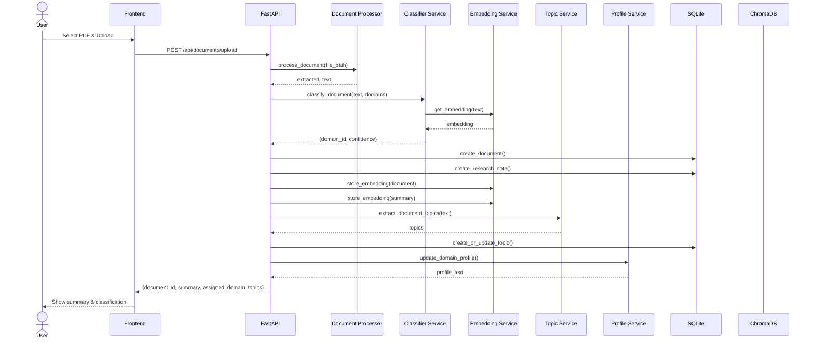
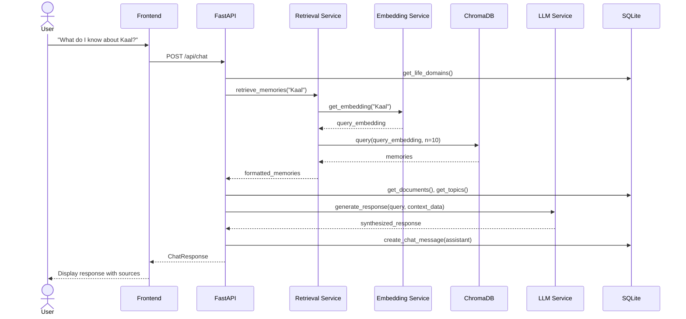
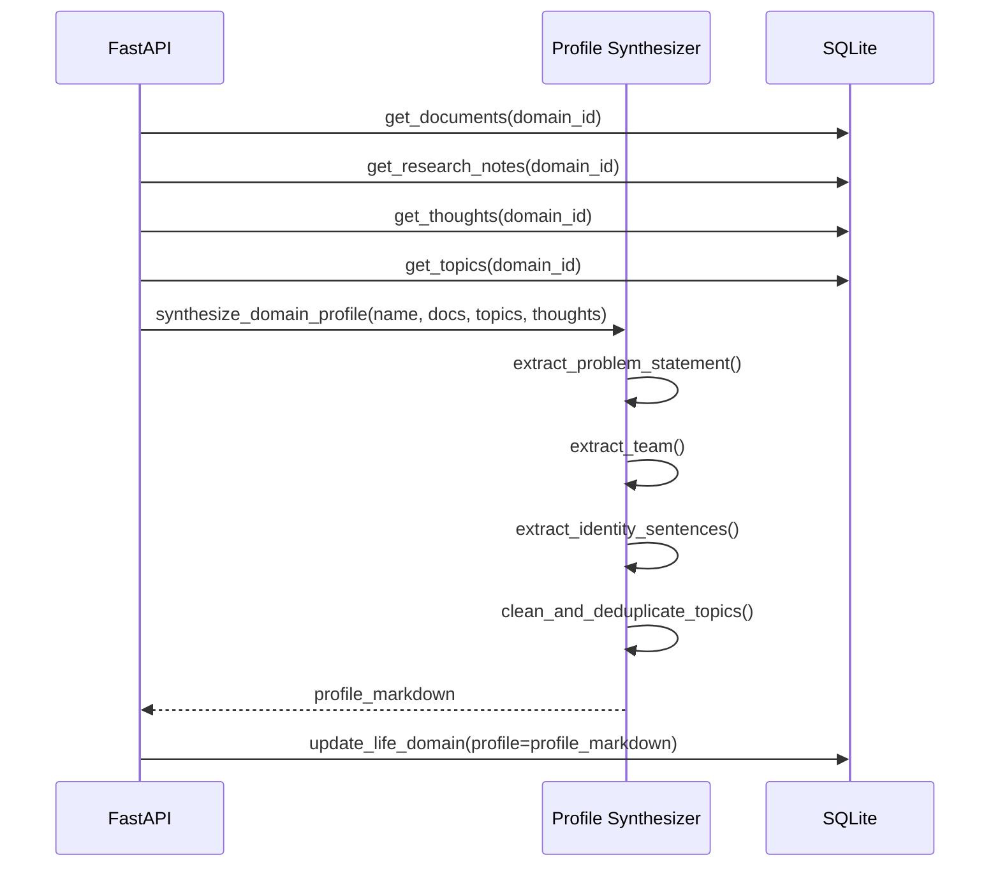

# Sage - Comprehensive Interview Preparation Documentation

> **Purpose:** This documentation exists to prepare you to confidently discuss Sage in technical interviews for AI Engineer, LLM Engineer, GenAI Engineer, Agentic AI Engineer, Applied AI Engineer, and Software Engineer roles. Every concept is explained from first principles. Assume the interviewer has never heard of Sage.

---

## Table of Contents

1. [Project Overview](#1-project-overview)
2. [Complete System Architecture](#2-complete-system-architecture)
3. [Feature Documentation](#3-feature-documentation)
4. [Technology Stack](./SAGE_TECHNOLOGY_STACK.md)
5. [Architecture Decisions](./SAGE_ARCHITECTURE_DECISIONS.md)
6. [Design Patterns](./SAGE_ARCHITECTURE_DECISIONS.md#6-design-patterns)
7. [Data Flow](#7-data-flow)
8. [Folder Structure](#8-folder-structure)
9. [APIs](./SAGE_API_DOCUMENTATION.md)
10. [Database Documentation](./SAGE_DATABASE_SCHEMA.md)
11. [Interview Questions](./SAGE_INTERVIEW_PREP.md#11-interview-questions)
12. [Technical Glossary](./SAGE_INTERVIEW_PREP.md#12-technical-glossary)
13. [Lessons Learned](#13-lessons-learned)
14. [Resume & Interview Notes](#14-resume--interview-notes)

---

# 1. Project Overview

## What is Sage?

Sage is an **AI Chief of Staff** --- an agentic AI system with **infinite memory** designed for knowledge workers who manage complex, multi-year career journeys across many projects, research threads, and decisions. It is not a productivity app, not a task manager, not a note-taking app, and not a chatbot. It is a **decision-quality optimizer**.

The core insight behind Sage is that the real problem knowledge workers face is not forgetting where they put a note. It is **losing the thread of who they were becoming**. When you return to a project after weeks or months away, the cognitive tax of reconstructing context --- saying "let me explain from the beginning" --- is enormous. Sage eliminates that tax.

## What Problem Does It Solve?

The problem is **context reconstruction cost**.

Imagine you are working on five projects simultaneously: an AI startup, a social enterprise, a research paper, a content series, and your own personal development. You pour insights into each. Then life interrupts you for a month. When you return, you do not need a to-do list. You need a **briefing**: What was I thinking? What decisions were pending? What insights had I accumulated? What connected to what?

Traditional tools fail here:
- **Note-taking apps** store information but do not connect it.
- **Task managers** track execution but not understanding.
- **Chatbots** forget everything when the session ends.
- **Dashboards** show status but not meaning.

Sage preserves the **living state of your work** across unlimited time and conversations.

## Why Was It Created?

Sage was created by Shubhi Katiyar, an AI engineer and founder who noticed a pattern across every domain of life: insights, realizations, and project contexts were constantly being lost because no tool understood that work is not a collection of tasks --- it is a **continuous thread of inquiry**.

The founding principle: **If Sage cannot solve the founder's daily problem of losing project state, it has no business claiming it can help others.**

## Target Users

- **Primary:** The founder themself (dogfooding as validation).
- **Future:** Knowledge workers with multi-year, multi-project careers --- researchers, founders, writers, strategists, executives, academics.
- **Not for:** People who need simple task lists or quick answers from the internet.

## Core Objectives

1. **Preserve continuity:** Remember everything the user shares across unlimited time.
2. **Reconstruct context:** When the user says "Bring me back," reconstruct their project state within minutes.
3. **Synthesize understanding:** Turn scattered notes, documents, and insights into coherent briefings.
4. **Optimize decision quality:** Not execution speed. The user decides; Sage provides evidence and options.
5. **Learn vocabulary:** Adapt to the user's patterns, priorities, and language over time.

## High-Level Architecture

Sage is a full-stack application with a clear separation of concerns:



## End-to-End Workflow

1. **User uploads a document** (PDF, DOCX, TXT, MD) or types a thought into chat.
2. **Document processor** extracts text and preserves tables.
3. **Classifier service** uses semantic similarity to determine which life domain the content belongs to.
4. **Embedding service** generates vector embeddings and stores them in ChromaDB.
5. **Topic extractor** pulls out key themes and concepts.
6. **Profile synthesizer** rebuilds a structured understanding of that domain.
7. **User asks a question** --- "What do I know about Kaal?" or "Bring me back."
8. **Retrieval service** performs vector search across memories.
9. **LLM service** generates a human-like response using retrieved context + founder knowledge.
10. **Response is returned** with sources and memory references.

## Future Roadmap

| Phase | Focus | Key Deliverable |
|-------|-------|-----------------|
| MVP | Chat + Memory | "Bring me back" works reliably |
| Phase 2 | Dashboard | Mode-adaptive UI (Explore, Orient, Understand, Create) |
| Phase 3 | Agent Actions | Send emails, create documents, schedule on behalf of user |
| Phase 4 | Knowledge Graph | Visualize connections between projects and insights |
| Phase 5 | Multi-user | Teams, shared context, collaborative memory |
| 10-year | Career-long memory | Trusted with decades of professional context |

---

# 2. Complete System Architecture

Sage's architecture is organized into distinct layers, each with clear responsibilities. Understanding why each layer exists is critical for interview discussions.

## 2.1 Frontend Layer

**Technology:** React 18 + Vite + Tailwind CSS + React Router

**Purpose:** Provide an interface that adapts to how humans think, not force humans to adapt to software.

**Responsibilities:**
- Render the domain sidebar with hierarchical life domains.
- Manage chat interface across five layers (general, life, project, knowledge, system).
- Display document viewer for uploaded files.
- Show dashboard with domain profiles and activity.
- Handle routing between views.

**Inputs:** User interactions (clicks, text input, file uploads).
**Outputs:** HTTP requests to the FastAPI backend, rendered UI updates.

**Key Design Decision:** The frontend is intentionally simple. The intelligence lives in the backend. This keeps the frontend replaceable and allows the same backend to serve multiple interfaces (web, mobile, CLI) in the future.

**Scalability:** The frontend is a Single Page Application (SPA) that can be statically hosted. The backend handles all heavy computation.

## 2.2 Backend Layer

**Technology:** FastAPI (Python 3.11+)

**Purpose:** Serve as the central nervous system of Sage. Every request flows through here.

**Responsibilities:**
- Define REST API endpoints for all operations.
- Manage database transactions via SQLAlchemy.
- Orchestrate service calls (embedding, retrieval, LLM generation, classification).
- Handle file uploads and storage.
- Enforce data validation via Pydantic schemas.

**Why FastAPI?** See [Architecture Decisions](./SAGE_ARCHITECTURE_DECISIONS.md#why-fastapi).

**Key Endpoints:**
- `/api/chat` --- General chat with memory
- `/api/chat/layer` --- Layer-specific chat (general, life, project, knowledge, system)
- `/api/life-domains` --- CRUD for life domains
- `/api/documents/upload` --- Document upload and auto-classification
- `/api/retrieve` --- Vector memory retrieval
- `/api/seed` --- Seed default domains

## 2.3 API Layer

The API layer is RESTful and stateless. Each endpoint is self-contained and idempotent where possible.

**Design Philosophy:**
- **Explicit over implicit:** Every endpoint clearly declares what it does.
- **Validation at the gate:** Pydantic schemas enforce types and constraints before any business logic runs.
- **Dependency injection:** The `get_db()` dependency ensures every request gets a fresh database session that is properly closed.

## 2.4 LLM Layer

**Technology:** Multi-provider abstraction (Groq, Anthropic, OpenAI, Moonshot)

**Purpose:** Generate human-like, context-aware responses that feel like talking to a trusted friend who happens to remember everything.

**Architecture:**
- A unified `generate_response()` function that abstracts provider differences.
- Provider priority: Groq (fastest) > Anthropic > OpenAI > Moonshot.
- Graceful fallback: If no LLM is available, Sage uses a structured fallback synthesizer that constructs responses from founder knowledge and domain profiles.

**Key Innovation:** The LLM is not the product. The LLM is a **component** that answers questions using retrieved context. Without the retrieval layer, the LLM is just a chatbot. With retrieval, it becomes an agent with memory.

**System Prompt Engineering:**
Sage uses a carefully crafted system prompt (`SAGE_SYSTEM_PROMPT`) that defines:
- Communication style (warm, conversational, human-like)
- Greeting rules (use name on first message, never on follow-ups)
- Context usage rules (PROJECT DOCUMENT is primary source)
- Emotional range (react appropriately, use "we" and "our")

## 2.5 Memory Layer

**Technology:** Dual-store architecture --- SQLite (structured) + ChromaDB (vector)

**Purpose:** Provide both exact retrieval (SQL) and semantic retrieval (vector search).

**Why Two Stores?**
- **SQLite** stores the "what": domain definitions, chat history, document metadata, deadlines, thoughts.
- **ChromaDB** stores the "meaning": vector embeddings of every document, thought, and note for semantic search.

This is a classic pattern in RAG systems: structured data for relationships, vector data for similarity.

## 2.6 Knowledge Base

Sage has two knowledge sources:

1. **User-generated knowledge:** Documents, thoughts, research notes, and insights that the user feeds into Sage.
2. **Founder context:** A hardcoded Python dictionary (`founder_context.py`) that encodes the founder's understanding of each project --- its essence, why it exists, current status, key concepts, and connections to other projects.

**Why hardcode founder knowledge?** In the MVP, the founder's understanding is the most reliable source of truth about each project. Documents may be incomplete or ambiguous. The founder context ensures Sage can always say something meaningful, even with minimal user data.

## 2.7 RAG Pipeline

**RAG = Retrieval-Augmented Generation**

Sage implements a full RAG pipeline:



**Key Detail:** Sage does not rely on the LLM's parametric knowledge (what it learned during training). It relies on **retrieved context** (what the user actually shared). This prevents hallucinations about the user's specific projects.

## 2.8 Embedding Pipeline

**Technology:** Sentence Transformers (`all-MiniLM-L6-v2`) + ChromaDB

**Process:**
1. Text is chunked into 512-word pieces with 50-word overlap.
2. Each chunk is converted to a 384-dimensional dense vector.
3. Vectors are stored in ChromaDB with metadata (type, domain ID, source).

**Why `all-MiniLM-L6-v2`?** It is small (22MB), fast, and produces high-quality sentence embeddings. For an MVP, it is the pragmatic choice. Production systems might use larger models or fine-tuned embeddings.

## 2.9 Vector Database

**Technology:** ChromaDB (persistent local instance)

**Role:** Store and query embeddings at scale.

**Current Scale:** Local SQLite-backed Chroma. For production, this would migrate to a server instance or cloud vector DB (Pinecone, Weaviate, Qdrant).

## 2.10 Tool Execution

**Current:** Document processing (PDF, DOCX, TXT extraction).
**Future:** Email sending, calendar scheduling, document creation, web search (explicitly triggered).

## 2.11 Agent Workflow

Sage is not a single agent. It is a **multi-layer conversational system**:

| Layer | Purpose | Example Query |
|-------|---------|---------------|
| General | Anything goes | "What should I focus on today?" |
| Life | Personal domains | "How is my career trajectory?" |
| Project | Active builds | "What is the status of Kaal?" |
| Knowledge | Research & learning | "What do I know about neuroplasticity?" |
| System | How Sage works | "How does my memory work?" |

Each layer biases retrieval toward relevant domains and uses the conversation history for that layer as additional context.

## 2.12 Context Management

Context is built hierarchically:

1. **System prompt** (static): Defines Sage's personality.
2. **Dynamic system additions** (per-request): Conversation status (first message vs. follow-up).
3. **Context data** (per-query): Domain name, profile, retrieved memories, topics, documents.
4. **Conversation history** (per-layer): Last 5 messages in the current layer.

The total context is assembled into a single string and sent to the LLM.

## 2.13 Prompt Management

Prompts are not strings scattered through the code. They are:
- **Centralized** in `llm_service.py` as constants.
- **Dynamic** --- the system prompt changes based on conversation length.
- **Tested** --- the fallback synthesizer ensures Sage works even when LLMs fail.

## 2.14 Authentication

**Current:** Single-user system. A `users` table exists but has minimal auth.
**Future:** OAuth, API keys, multi-user support.

## 2.15 Logging & Monitoring

**Current:** Print statements and console logging.
**Future:** Structured logging (JSON), metrics collection, alerting.

## 2.16 Deployment

**Current:** Local development. Backend runs via Uvicorn. Frontend is a Vite dev server.
**Future:** Docker containerization, cloud deployment (Render, Railway, AWS), CI/CD pipeline.

---

# 3. Feature Documentation

## 3.1 Document Upload & Auto-Classification

**Why it exists:** Users should not manually categorize every document. The system should understand what the document is about and place it in the correct domain.

**How it works:**
1. User uploads a file via `/api/documents/upload`.
2. `process_document()` extracts text (PDF -> pdfplumber -> PyPDF2 fallback; DOCX -> python-docx).
3. `summarize_document()` creates a structured summary with word count, key topics, overview, and table preservation.
4. `classify_document()` embeds both the document text and every domain name+description, then computes cosine similarity.
5. Special rules override semantic matching: if a document mentions "Sage funding," it goes to the Sage project, not Finance.
6. The document is stored, a research note is created, embeddings are stored, topics are extracted, and the domain profile is updated.

**Edge Cases:**
- Empty PDFs: Handled by fallback text extractors.
- Unknown file types: Rejected gracefully.
- No matching domain: Stored in a default "knowledge" domain.

## 3.2 "Bring Me Back"

**Why it exists:** The signature feature of Sage. After time away from a project, the user needs orientation, not a to-do list.

**How it works:**
1. User types "bring me back to [Project]" or "where was I."
2. If a domain is mentioned, retrieve memories filtered to that domain.
3. Otherwise, retrieve general memories across all domains.
4. The top 3 memories are formatted into a context string.
5. The LLM synthesizes a briefing (MVP uses raw retrieval with a note that synthesis is coming).

**Limitations:** Currently returns raw retrieval. Phase 4 will add true synthesis with timeline reconstruction and change detection.

## 3.3 Layer-Based Chat

**Why it exists:** Not all conversations are the same. Talking about your career is different from talking about a specific project.

**How it works:**
- Each layer has its own conversation history in the database.
- When a user chats in the "project" layer, retrieval is biased toward project domains.
- Auto-store: Every user message is classified and stored as a thought in the most relevant domain.
- Auto-document: Messages are appended to domain overview documents with semantic formatting (Vision, Architecture, Decision, Insight, etc.).

## 3.4 Domain Profile Synthesis

**Why it exists:** Raw documents are too long and noisy. A profile is a distilled understanding that can be shown in a dashboard or used in LLM context.

**How it works:**
- Gathers all documents, research notes, and thoughts for a domain.
- Extracts structured information: identity sentences, problem statements, team names, key topics, recent uploads.
- Builds a markdown-formatted profile with sections like "What it is," "Problem it solves," "Key themes."
- Updates automatically after every document upload.

## 3.5 Topic Extraction

**Why it exists:** Users do not manually tag everything. Automatic topic detection helps discover themes and connections.

**How it works:**
1. Extract headings from markdown (highest confidence).
2. Extract capitalized phrases (named entities).
3. Extract frequent bigrams and trigrams.
4. Filter with stop words and deduplicate with similarity threshold.
5. Store in `topics` table with frequency counts.

---

# 7. Data Flow

## 7.1 User Uploads a Document



## 7.2 User Asks a Question (RAG Flow)



## 7.3 Domain Profile Update After Upload



---

# 8. Folder Structure

```
sage-core/
|-- 00_constitution/           # Foundational principles, ethics, mission
|   |-- 00_FOUNDER_KNOWLEDGE_BASE.md   # Session transcripts & founder insights
|   |-- CORE_PRINCIPLES.md
|   |-- MISSION.md
|   |-- PRODUCT_CONSTITUTION.md
|   |-- ...
|
|-- 01_product/                # Product docs: vision, roadmap, specs
|   |-- SAGE_PLAN.md           # Comprehensive product plan (1053 lines)
|   |-- MVP_SPEC.md
|   |-- ROADMAP.md
|   |-- TARGET_USERS.md
|   |-- ...
|
|-- 02_design/                 # Design system, wireframes, interaction patterns
|   |-- DESIGN_SYSTEM.md
|   |-- USER_FLOWS.md
|   |-- WIREFRAMES.md
|   |-- ...
|
|-- 03_architecture/           # Technical architecture decisions
|   |-- SYSTEM_ARCHITECTURE.md
|   |-- API_ARCHITECTURE.md
|   |-- MEMORY_ARCHITECTURE.md
|   |-- DATABASE_ARCHITECTURE.md
|   |-- DEPLOYMENT.md
|   |-- ...
|
|-- 04_engineering/            # Engineering standards, sprints, milestones
|   |-- CODING_STANDARDS.md
|   |-- FOLDER_STRUCTURE.md
|   |-- TESTING.md
|   |-- CHANGELOG.md
|   |-- ...
|
|-- 05_implementation/         # ACTUAL CODE
|   |-- backend/
|   |   |-- main.py              # FastAPI app, all endpoints
|   |   |-- models.py            # SQLAlchemy ORM models
|   |   |-- schemas.py           # Pydantic request/response models
|   |   |-- crud.py              # Database CRUD operations
|   |   |-- database.py          # SQLAlchemy engine & session
|   |   |-- requirements.txt     # Python dependencies
|   |   |-- .env                 # API keys & config
|   |   |-- services/
|   |   |   |-- llm_service.py         # Multi-provider LLM abstraction
|   |   |   |-- embedding_service.py   # Sentence Transformers + ChromaDB
|   |   |   |-- retrieval_service.py   # Vector memory retrieval
|   |   |   |-- classifier_service.py  # Semantic document classification
|   |   |   |-- topic_service.py       # Topic extraction from text
|   |   |   |-- profile_service.py     # Domain profile synthesis
|   |   |   |-- document_processor.py  # PDF/DOCX/TXT extraction
|   |   |   |-- founder_context.py     # Hardcoded founder knowledge
|   |   |-- chroma_db_sage_v3/   # ChromaDB vector store files
|   |   |-- uploads/             # Uploaded document storage
|   |
|   |-- frontend/
|   |   |-- src/
|   |   |   |-- App.jsx          # Main app with routing
|   |   |   |-- components/      # Reusable UI components
|   |   |   |-- pages/           # ChatPage, DashboardPage
|   |   |-- vite.config.js       # Vite build config
|   |   |-- package.json
```

**Key Insight:** The numbered folders (00-05) reflect the founder's systems-thinking approach --- structure before substance. Even the repository organization encodes a philosophy: constitution first, then product, then design, then architecture, then engineering, then implementation.

---

# 13. Lessons Learned

## What Was Learned

1. **Context reconstruction is harder than storage.** Storing data is easy. Understanding what matters when the user returns after a month is the real challenge.

2. **The LLM is not the product.** The product is the **system** that retrieves, synthesizes, and presents context. The LLM is just one component.

3. **Fallbacks matter.** If the LLM fails (rate limit, no API key, network error), Sage still works using the fallback synthesizer. Graceful degradation is essential.

4. **Hardcoded knowledge is a valid MVP strategy.** The `founder_context.py` file seems like a hack, but it ensures Sage is always useful, even with zero user data.

5. **Semantic classification beats keyword matching.** Using embeddings to classify documents is far more robust than regex or keyword lists, though keyword rules are still needed as overrides.

## Challenges Encountered

1. **Project finance vs. personal finance:** Documents about "Sage funding" were incorrectly classified into the "Finance" life domain instead of the "Sage" project. Solved with explicit override rules in the classifier.

2. **LLM greeting repetition:** The LLM kept saying "Hey Shubhi" on every message, even follow-ups. Solved with dynamic system prompt injection and post-processing regex.

3. **Document extraction quality:** PDFs with complex layouts (tables, columns) extracted poorly. Solved with pdfplumber as primary and PyPDF2 as fallback.

4. **Topic noise:** Extracted topics included duplicates like "Mood Mood" and generic terms. Solved with stop-word filtering and deduplication logic.

## Performance Considerations

- **Embedding generation is synchronous and blocking.** For large documents, this slows the upload response. Future: move to background tasks (Celery, RQ, or async).
- **ChromaDB is local and single-node.** Will not scale beyond a single machine. Future: migrate to cloud vector DB.
- **SQLite is sufficient for MVP** but will need PostgreSQL for concurrent multi-user access.

## Security Considerations

- API keys are stored in `.env` (not committed to git).
- No user authentication yet --- single-user assumption.
- Uploaded files are stored on local filesystem with UUID filenames to prevent path traversal.
- CORS is restricted to localhost ports for development.

---

# 14. Resume & Interview Notes

## Resume Bullet Points

1. **Built Sage, an AI Chief of Staff with infinite memory** --- a full-stack agentic AI system that preserves project context across months using RAG, vector embeddings, and multi-provider LLMs.

2. **Designed and implemented a multi-layer RAG pipeline** combining sentence transformers (MiniLM), ChromaDB vector search, and structured SQLite storage for semantic memory retrieval.

3. **Engineered a semantic document classification system** using cosine similarity on embeddings with rule-based overrides, achieving accurate auto-categorization across 15+ life domains.

4. **Built a multi-provider LLM abstraction layer** supporting Groq, Anthropic, OpenAI, and Moonshot with graceful fallback to a structured response synthesizer.

5. **Implemented domain profile synthesis** --- an automated pipeline that distills documents, topics, and thoughts into structured markdown profiles updated in real time.

## 30-Second Explanation

> "Sage is an AI Chief of Staff I built to solve a problem I kept having: I'd work on multiple projects, accumulate insights, then lose the thread when I returned weeks later. Sage remembers everything I share --- documents, thoughts, research --- and when I say 'Bring me back,' it reconstructs my project state in minutes. It uses a RAG pipeline with vector embeddings and multiple LLM providers to generate context-aware responses."

## 2-Minute Explanation

> "Sage is an agentic AI system with infinite memory for knowledge workers. The core problem it solves is context reconstruction cost --- the cognitive tax of rebuilding mental state after interruptions. 
>
> The architecture has a React frontend, a FastAPI backend, and a dual-store data layer: SQLite for structured data and ChromaDB for vector embeddings. When you upload a document, Sage extracts text, classifies it into life domains using semantic similarity, generates embeddings, extracts topics, and updates a synthesized profile for that domain. 
>
> When you ask a question, Sage embeds your query, searches the vector database for relevant memories, assembles context, and sends it to an LLM with a carefully engineered system prompt. The LLM can be Groq, Anthropic, OpenAI, or Moonshot --- Sage abstracts all providers into a single interface. 
>
> Key features include layer-based chat, auto-document classification, 'Bring me back' context reconstruction, and real-time domain profile synthesis. The system is built to be corrigible --- it prefers being correctable over being correct."

## Detailed Technical Explanation (for System Design Interviews)

> "Sage is a full-stack RAG application with a clear separation between retrieval and generation. Let me walk through the architecture...
>
> **Data Ingestion:** Documents are processed through a pipeline: extraction (pdfplumber/PyPDF2/python-docx) -> summarization (heuristic-based) -> classification (embedding cosine similarity with rule overrides) -> embedding (Sentence Transformers all-MiniLM-L6-v2) -> vector storage (ChromaDB). Simultaneously, structured metadata goes into SQLite via SQLAlchemy.
>
> **Retrieval:** When a user queries, we generate an embedding of the query, perform approximate nearest neighbor search in ChromaDB, and retrieve the top-k most semantically similar memories. We also fetch structured context from SQLite --- domain profiles, recent documents, key topics.
>
> **Generation:** We assemble a context string containing the retrieved memories, domain profile, and conversation history. This is sent to an LLM with a dynamic system prompt that adapts based on conversation length (first message gets a greeting, follow-ups do not). The LLM is instructed to use PROJECT DOCUMENTS as primary sources and to never hallucinate project details.
>
> **Fallback:** If no LLM is available, Sage uses a structured synthesizer that builds responses from founder knowledge and domain profiles. This ensures the system is never completely down.
>
> **Scalability:** Currently single-node. The embedding step is the bottleneck. For scale, we'd add async task queues (Celery), migrate to PostgreSQL, and replace local ChromaDB with a cloud vector database like Pinecone or Weaviate."

## Potential Follow-Up Interview Questions

1. "How would you scale the embedding generation for millions of documents?"
   - *Answer: Async task queues (Celery + Redis), batch processing, GPU inference with ONNX Runtime, potentially fine-tuning a smaller model for domain-specific embeddings.*

2. "How do you prevent hallucinations about the user's projects?"
   - *Answer: RAG-first architecture. The LLM is instructed to use retrieved PROJECT DOCUMENTS as primary sources. If the document doesn't contain the answer, it must say so. We also use a fallback synthesizer that only uses known data.*

3. "Why SQLite instead of PostgreSQL?"
   - *Answer: MVP pragmatism. SQLite requires zero setup, is file-based, and is sufficient for a single-user local system. The code is written with SQLAlchemy, so migrating to PostgreSQL is a one-line config change.*

4. "How would you handle multi-user scenarios?"
   - *Answer: Add user_id foreign keys to all tables, implement JWT authentication, isolate vector collections per user, and add row-level security in PostgreSQL.*

5. "What is your strategy for long-term memory?"
   - *Answer: Currently all embeddings are stored indefinitely. For long-term scaling, we'd implement memory pruning (forget unreferenced memories), hierarchical summarization (summarize old conversations into higher-level embeddings), and archival strategies.*

## Common Mistakes Candidates Make

1. **Focusing on the LLM:** Interviewers will ask about the LLM, but the real engineering is in the retrieval and context assembly. Do not over-index on model choice.

2. **Ignoring the fallback:** A production system must work when LLMs fail. Mention the fallback synthesizer.

3. **Not explaining RAG:** Many candidates say "we use RAG" without explaining the actual pipeline --- embedding, similarity search, context assembly, generation.

4. **Forgetting data flow:** Be ready to trace a document from upload to response. Interviewers love end-to-end tracing.

5. **Overselling:** Sage is an MVP. Be honest about limitations (single-user, local DB, no async) and have a clear migration path.

---

*This documentation is a living document. Every architectural or implementation change should update the relevant sections.*
