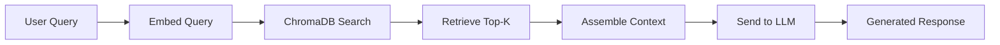

# Sage Technology Stack Deep-Dive

> **Purpose:** For every technology in Sage, explain what it is, why it was chosen, alternatives considered, advantages, disadvantages, industry usage, how Sage uses it, important APIs/classes, common mistakes, and best practices. This document prepares you to discuss any piece of the stack in depth.

---

## Table of Contents

1. [FastAPI](#1-fastapi)
2. [SQLAlchemy](#2-sqlalchemy)
3. [Pydantic](#3-pydantic)
4. [SQLite](#4-sqlite)
5. [ChromaDB](#5-chromadb)
6. [Sentence Transformers](#6-sentence-transformers)
7. [RAG (Retrieval-Augmented Generation)](#7-rag-retrieval-augmented-generation)
8. [Vector Databases](#8-vector-databases)
9. [Anthropic Claude / OpenAI GPT / Groq / Moonshot](#9-llm-providers)
10. [React + Vite](#10-react--vite)
11. [Python Async](#11-python-async)
12. [Docker (Planned)](#12-docker)
13. [PyPDF2 / pdfplumber / python-docx](#13-document-processing-libraries)

---

## 1. FastAPI

### What It Is

FastAPI is a modern, high-performance Python web framework for building APIs. It is built on Starlette (for async) and Pydantic (for validation). It was created by Sebastián Ramírez and released in 2018.

### Why It Exists

Before FastAPI, Python API development had a tension:
- **Flask** was simple but required manual validation and had no native async support.
- **Django REST Framework** was powerful but opinionated and heavy.
- **Tornado** had async but was complex.

FastAPI solved this by combining automatic validation, async support, and minimal boilerplate.

### Why It Was Chosen for Sage

1. **Automatic validation:** Every request and response is validated by Pydantic models. This eliminates an entire class of bugs.
2. **Async-native:** Built on Starlette, FastAPI supports `async`/`await` out of the box. While Sage currently uses synchronous SQLAlchemy, the framework supports future async migration.
3. **Auto-generated docs:** Swagger UI and ReDoc are generated automatically from type hints. This is invaluable for MVP development.
4. **Minimal boilerplate:** Endpoints are just Python functions with type annotations.
5. **Dependency injection:** The `Depends(get_db)` pattern ensures clean, testable code.

### Alternatives Considered

| Framework | Pros | Cons | Why Not Chosen |
|-----------|------|------|----------------|
| Flask | Simple, huge ecosystem | Manual validation, no native async | Too much boilerplate |
| Django | Batteries included, ORM | Heavy, opinionated, steep learning curve | Overkill for an API-only backend |
| Tornado | Async, mature | Complex, declining community | FastAPI is the modern successor |
| Express.js (Node) | Fast, JavaScript ecosystem | Not Python, different ecosystem | Team expertise is Python |

### Advantages

- **Type safety:** Request bodies are validated against Pydantic schemas. Invalid requests return 422 automatically.
- **Performance:** Benchmarks show FastAPI is on par with Node.js and Go for I/O-bound workloads.
- **Developer experience:** Hot reload, auto-docs, clear error messages.
- **Extensibility:** Middleware, CORS, background tasks are all built-in.

### Disadvantages

- **Relatively young:** Released in 2018, so the ecosystem is smaller than Flask/Django.
- **Magic:** The automatic validation and docs can obscure what is actually happening.
- **Async complexity:** While supported, mixing sync and async code (as Sage does with SQLAlchemy) can cause issues.

### Industry Usage

- Microsoft (Azure services)
- Uber (internal tools)
- Netflix (data platform)
- Many AI/ML startups (natural fit for Python backends)

### How Sage Uses It

```python
from fastapi import FastAPI, Depends, HTTPException
from sqlalchemy.orm import Session

app = FastAPI(title='Sage API', version='0.2.0')

def get_db():
    db = SessionLocal()
    try:
        yield db
    finally:
        db.close()

@app.post('/api/chat')
def chat(message: ChatMessage, db: Session = Depends(get_db)):
    # Business logic here
    return ChatResponse(response=...)
```

**Key pattern:** `Depends(get_db)` injects a fresh database session per request and guarantees cleanup via the `finally` block.

### Important APIs / Classes

- `FastAPI()` --- Application instance
- `HTTPException` --- Standard HTTP errors
- `Depends()` --- Dependency injection
- `UploadFile` / `File` / `Form` --- File upload handling
- `CORSMiddleware` --- Cross-origin request handling

### Common Mistakes

1. **Forgetting to close sessions:** Without `try/finally`, database connections leak.
2. **Mixing sync and async ORM:** SQLAlchemy 1.x is synchronous. Calling async code from sync endpoints or vice versa causes blocking.
3. **Not handling large file uploads:** `UploadFile` reads into memory by default. For production, stream to disk.

### Best Practices

- Use Pydantic models for every request and response.
- Keep endpoints thin --- delegate to service layers.
- Use `HTTPException` for expected errors, not generic `Exception`.
- Tag and document endpoints for auto-generated Swagger.

---

## 2. SQLAlchemy

### What It Is

SQLAlchemy is the most widely used Python SQL toolkit and Object-Relational Mapping (ORM) library. It provides a full suite of well-known enterprise-level persistence patterns.

### Why It Exists

Raw SQL is powerful but error-prone. SQLAlchemy abstracts database operations into Python objects while still allowing raw SQL when needed.

### Why It Was Chosen for Sage

1. **ORM convenience:** Models are Python classes. Relationships are defined declaratively.
2. **Database agnostic:** SQLite today, PostgreSQL tomorrow --- the code barely changes.
3. **Mature ecosystem:** 20+ years of development, extensive documentation, community support.
4. **Alembic integration:** Future database migrations are straightforward.

### How Sage Uses It

**Declarative Base Pattern:**

```python
from sqlalchemy import Column, String, Text, DateTime, ForeignKey
from sqlalchemy.orm import relationship, declarative_base

Base = declarative_base()

class LifeDomain(Base):
    __tablename__ = "life_domains"
    id = Column(String, primary_key=True, default=generate_uuid)
    name = Column(String, nullable=False)
    description = Column(Text, nullable=True)
    layer = Column(String, default="life")
    parent_id = Column(String, ForeignKey("life_domains.id"), nullable=True)
    profile = Column(Text, nullable=True)
    
    thoughts = relationship("Thought", back_populates="life_domain", cascade="all, delete-orphan")
    documents = relationship("Document", back_populates="life_domain", cascade="all, delete-orphan")
```

**Key pattern:** `cascade="all, delete-orphan"` ensures that when a domain is deleted, all its thoughts and documents are also deleted.

### Important Classes / Patterns

- `declarative_base()` --- Base class for all models
- `relationship()` --- Define ORM relationships
- `Session` --- Unit of work pattern
- `create_engine()` --- Database connection factory
- `ForeignKey` --- Referential integrity

### Common Mistakes

1. **N+1 queries:** Accessing `domain.thoughts` in a loop without eager loading causes N+1 queries. Use `joinedload` or `selectinload`.
2. **Forgetting to commit:** Changes are not persisted until `db.commit()`.
3. **Session leaks:** Sessions must always be closed. Use context managers.
4. **SQLite concurrency:** SQLite locks the entire database on write. Not suitable for high-concurrency multi-user scenarios.

---

## 3. Pydantic

### What It Is

Pydantic is a Python library for data validation using Python type hints. It is the foundation of FastAPI's request/response handling.

### Why It Exists

Python is dynamically typed. Runtime validation is tedious and error-prone. Pydantic lets you define schemas as classes and automatically validates incoming data.

### Why It Was Chosen for Sage

1. **FastAPI integration:** FastAPI uses Pydantic models for automatic request validation and response serialization.
2. **Type safety:** Catches type mismatches at runtime.
3. **JSON serialization:** Models serialize to JSON automatically.
4. **Editor support:** Type hints give autocomplete and error detection in IDEs.

### How Sage Uses It

```python
from pydantic import BaseModel, Field
from typing import Optional, List
from datetime import datetime

class ChatMessage(BaseModel):
    life_domain_id: Optional[str] = None
    message: str = Field(..., min_length=1)
    layer: Optional[str] = "general"

class ChatResponse(BaseModel):
    response: str
    conversation_id: Optional[str] = None
    retrieved_memories: List[RetrievedMemory] = []
```

**Key pattern:** `Field(..., min_length=1)` enforces that the message cannot be empty.

### Important Classes

- `BaseModel` --- Base class for all schemas
- `Field()` --- Field-level validation (min_length, max_length, regex, etc.)
- `Config` class --- Model configuration (e.g., `from_attributes = True` for ORM mode)

### Common Mistakes

1. **Forgetting `from_attributes = True`:** Without this, Pydantic cannot read SQLAlchemy objects.
2. **Circular references:** Complex nested models can cause import cycles.
3. **Over-validating:** Requiring too many fields makes APIs brittle.

---

## 4. SQLite

### What It Is

SQLite is a C-language library that implements a small, fast, self-contained SQL database engine. It is serverless, zero-configuration, and transactional.

### Why It Exists

Not every application needs a full database server. SQLite provides SQL capabilities in a single file.

### Why It Was Chosen for Sage

1. **Zero setup:** No installation, no configuration, no running server.
2. **Single file:** The entire database is a `.db` file. Easy to back up, version (carefully), and transfer.
3. **Sufficient for MVP:** Single-user, local development --- SQLite handles this perfectly.
4. **Easy migration path:** SQLAlchemy abstracts the database. Switching to PostgreSQL later is trivial.

### Alternatives Considered

| Database | Pros | Cons | Why Not Chosen |
|----------|------|------|----------------|
| PostgreSQL | Full-featured, concurrent, scalable | Requires setup, running server | Overkill for MVP |
| MySQL | Widely used, good performance | Requires setup, licensing complexity | Same as PostgreSQL |
| MongoDB | Flexible schema, JSON-like | Not relational, overkill | Sage needs relationships |

### Disadvantages of SQLite in Production

1. **Concurrency:** Write locks the entire database.
2. **No network access:** Must be on the same machine.
3. **Limited types:** No native UUID, array, or JSON types (though JSON1 extension helps).
4. **No user management:** No roles, permissions, or access control.

### How Sage Uses It

```python
DATABASE_URL = os.getenv("DATABASE_URL", "sqlite:///./sage_v3.db")
engine = create_engine(DATABASE_URL, connect_args={"check_same_thread": False})
```

**Key detail:** `check_same_thread=False` is required for SQLite in FastAPI because each request runs in a different thread, but SQLAlchemy handles connection pooling.

---

## 5. ChromaDB

### What It Is

ChromaDB is an open-source embedding database. It stores and queries vector embeddings with metadata, making it ideal for RAG applications.

### Why It Exists

Traditional databases index by exact match or range query. Vector databases index by semantic similarity --- finding items that are "close in meaning" even if they use different words.

### Why It Was Chosen for Sage

1. **Simplicity:** pip install, create client, store embeddings. No complex setup.
2. **Persistent storage:** Can store data on disk (not just in-memory).
3. **Metadata filtering:** Store and filter by metadata (domain ID, type, etc.).
4. **Local first:** Runs locally, no API keys or cloud dependencies.

### Alternatives Considered

| Database | Pros | Cons | Why Not Chosen |
|----------|------|------|----------------|
| Pinecone | Managed, scalable, fast | Requires API key, paid tiers | Wanted local-first |
| Weaviate | GraphQL interface, modular | More complex setup | Chroma is simpler |
| FAISS | Meta's library, extremely fast | No persistence, no metadata | Chroma wraps FAISS with persistence |
| Qdrant | Rust-based, fast, filterable | Newer, smaller community | Chroma is more mature in Python |

### How Sage Uses It

```python
import chromadb
chroma_client = chromadb.PersistentClient(path='./chroma_db_sage_v3')

def store_embedding(collection_name, id, text, metadata=None):
    collection = chroma_client.get_or_create_collection(name=collection_name)
    embedding = get_embedding(text)  # Sentence Transformers
    collection.add(
        ids=[id],
        embeddings=[embedding],
        documents=[text],
        metadatas=[clean_metadata]
    )

def query_embeddings(collection_name, query_text, n_results=5):
    collection = chroma_client.get_or_create_collection(name=collection_name)
    query_embedding = get_embedding(query_text)
    return collection.query(query_embeddings=[query_embedding], n_results=n_results)
```

**Key pattern:** `get_or_create_collection` ensures the collection exists without error.

### Important APIs

- `PersistentClient(path=...)` --- Disk-based storage
- `get_or_create_collection()` --- Safe collection access
- `collection.add()` --- Store embeddings
- `collection.query()` --- Similarity search
- `collection.delete()` --- Remove embeddings

### Common Mistakes

1. **None values in metadata:** ChromaDB cannot handle `None` in metadata. Must clean before storing.
2. **Duplicate IDs:** Adding the same ID twice overwrites the previous entry.
3. **No embedding dimension mismatch:** All embeddings in a collection must have the same dimension.

---

## 6. Sentence Transformers

### What It Is

Sentence Transformers is a Python framework for state-of-the-art sentence, text, and image embeddings. It provides pretrained models that convert text into dense vector representations.

### Why It Exists

Word embeddings (Word2Vec, GloVe) represent individual words. Sentence Transformers represent entire sentences and paragraphs in a way that preserves semantic meaning.

### Why `all-MiniLM-L6-v2` Was Chosen

1. **Small:** 22MB. Fits anywhere.
2. **Fast:** Runs on CPU in milliseconds.
3. **High quality:** Trained on 1.1 billion sentence pairs. Excellent for semantic similarity.
4. **384-dimensional:** Compact but expressive enough for RAG.

### Alternatives Considered

| Model | Size | Dimension | Why Not Chosen |
|-------|------|-----------|----------------|
| all-mpnet-base-v2 | 420MB | 768 | Better quality but 20x larger |
| all-distilroberta-v1 | 290MB | 768 | Good balance but still large |
| OpenAI text-embedding-3 | API | 1536-3072 | Requires API key, network call |

### How Sage Uses It

```python
from sentence_transformers import SentenceTransformer
model = SentenceTransformer('all-MiniLM-L6-v2')

def get_embedding(text):
    embedding = model.encode(text)
    return embedding.tolist()  # Convert numpy array to list for JSON storage
```

**Key detail:** The model is loaded once at module import time and reused across requests. This avoids the overhead of reloading the model on every call.

### Best Practices

- Load the model once, not per-request.
- For production, consider ONNX Runtime for 2-3x speedup.
- Fine-tune on domain-specific data for better retrieval quality.

---

## 7. RAG (Retrieval-Augmented Generation)

### What It Is

RAG is an architecture pattern that combines retrieval systems with text generation models. Instead of relying solely on the LLM's training data, the system retrieves relevant documents from an external knowledge base and includes them in the prompt.

### Why It Exists

LLMs have two fundamental limitations:
1. **Static knowledge:** Their training data has a cutoff date.
2. **Hallucination:** They can generate plausible-sounding but factually incorrect answers.

RAG solves both by grounding the LLM in retrieved evidence.

### How Sage Implements RAG



**The critical rule:** Sage's LLM is instructed to use PROJECT DOCUMENTS as the primary source. If the retrieved context does not contain the answer, the LLM must say so.

### Advantages of RAG

- **Reduces hallucinations:** Answers are grounded in retrieved text.
- **Up-to-date knowledge:** New documents are immediately searchable.
- **Attribution:** Can cite sources (memory IDs).
- **Cost efficiency:** Smaller LLMs can be used because retrieval does the heavy lifting.

### Disadvantages of RAG

- **Retrieval quality depends on embeddings:** Poor embeddings = poor retrieval.
- **Context window limits:** Too many retrieved documents overflow the LLM's context.
- **Not suitable for reasoning:** RAG provides facts, not logical deduction.

### Industry Usage

- **OpenAI ChatGPT with browsing:** Retrieves from the web before answering.
- **Microsoft Copilot:** Retrieves from enterprise documents.
- **Perplexity AI:** Built entirely on RAG.
- **Enterprise AI:** Most production LLM applications use RAG.

### Common Mistakes

1. **Retrieving irrelevant documents:** Poor embedding quality or insufficient metadata filtering.
2. **Overstuffing context:** Sending 20 documents when the LLM can only process 5. Sage limits to top-k.
3. **No fallback:** If retrieval returns nothing, the system should say "I don't know" rather than hallucinate.

---

## 8. Vector Databases

### What They Are

A vector database is a database designed to store and query high-dimensional vectors (embeddings) efficiently. They use approximate nearest neighbor (ANN) algorithms to find similar vectors in sub-linear time.

### Why They Exist

Exact nearest neighbor search in high-dimensional space is computationally expensive (O(n) or worse). ANN algorithms like HNSW (Hierarchical Navigable Small World) reduce this to O(log n) with minimal accuracy loss.

### How Sage Uses Vector Search

Sage stores embeddings of every thought, document, and research note. When a user asks a question, Sage:
1. Converts the question to an embedding.
2. Queries ChromaDB for the nearest neighbors.
3. Returns the most semantically similar memories.

**This is the core of "infinite memory."** Without vector search, Sage would be a chatbot. With vector search, it is a memory system.

### Key Concepts

- **Embedding:** A dense vector representation of text (384 dimensions in Sage).
- **Cosine similarity:** Measures the angle between two vectors. Range: -1 to 1. Higher = more similar.
- **Euclidean distance:** Measures the straight-line distance between vectors.
- **ANN (Approximate Nearest Neighbor):** Fast, approximate search. Accepts small accuracy loss for massive speed gains.

---

## 9. LLM Providers

### Multi-Provider Strategy

Sage abstracts multiple LLM providers behind a single `generate_response()` function. This provides:
1. **Redundancy:** If one provider fails, another is tried.
2. **Cost optimization:** Use cheaper providers for simple tasks.
3. **Speed optimization:** Groq is fastest for inference.
4. **Flexibility:** Users can choose their preferred provider.

### Provider Comparison

| Provider | Model | Strengths | Weaknesses |
|----------|-------|-----------|------------|
| **Groq** | llama-3.3-70b | Fastest inference, no data training, free tier | Smaller context window |
| **Anthropic** | claude-3-haiku | Excellent reasoning, large context, safe | Slower, more expensive |
| **OpenAI** | gpt-3.5-turbo | Reliable, widely used, good docs | Data policies, pricing |
| **Moonshot** | kimi-k2.6 | Good Chinese/English, long context | Requires Chinese API access |

### How Sage Uses Them

```python
PREFERRED_PROVIDER = os.environ.get('LLM_PROVIDER', 'anthropic').lower()

def generate_response(user_message, context_data=None):
    # Try preferred provider, fall through others
    if PREFERRED_PROVIDER == 'anthropic' and get_anthropic_client():
        return _call_anthropic(prompt, system_prompt)
    elif get_openai_client():
        return _call_openai(prompt, system_prompt)
    elif get_groq_client():
        return _call_groq(prompt, system_prompt)
    else:
        return _fallback_response(user_message, context_data)
```

**Key insight:** The fallback synthesizer (`_fallback_response`) is not an afterthought. It is a core reliability feature.

---

## 10. React + Vite

### Why React

1. **Component model:** The UI is naturally decomposed into Sidebar, Chat, Dashboard, DocumentViewer.
2. **Ecosystem:** Massive library ecosystem, mature patterns.
3. **Team familiarity:** React is the most commonly known frontend framework.

### Why Vite

1. **Fast dev server:** Hot Module Replacement (HMR) in milliseconds.
2. **Modern bundling:** Uses esbuild and Rollup. Faster than Webpack.
3. **Simple config:** Minimal configuration required.

### How Sage Uses Them

```jsx
function App() {
  const [activeDomain, setActiveDomain] = useState(null)
  return (
    <div className="flex h-screen bg-sage-50">
      <Sidebar activeDomain={activeDomain} setActiveDomain={setActiveDomain} />
      <Routes>
        <Route path="/" element={<DashboardPage />} />
        <Route path="/chat" element={<ChatPage />} />
      </Routes>
    </div>
  )
}
```

---

## 11. Python Async

### What It Is

Python's `asyncio` library enables concurrent I/O-bound operations without threads. The `async` and `await` keywords define coroutines that yield control during I/O waits.

### Why It Matters for Sage

While Sage currently uses synchronous SQLAlchemy, the architecture is designed for async migration:
- LLM API calls are I/O-bound and could be parallelized.
- File uploads could be streamed asynchronously.
- Multiple retrieval queries could run concurrently.

### Current Limitations

SQLAlchemy 1.x (used in Sage) is synchronous. Mixing sync ORM with async FastAPI endpoints causes blocking. The solution is either:
1. Use `run_in_executor` to offload sync DB calls to a thread pool.
2. Upgrade to SQLAlchemy 2.0 with async support (`create_async_engine`).

### Best Practice for Interview

> "We use synchronous SQLAlchemy with FastAPI currently, but the architecture is designed for async migration. FastAPI supports async natively, and we plan to upgrade to SQLAlchemy 2.0's async engine for better concurrency."

---

## 12. Docker (Planned)

### Why Docker

Containerization ensures the application runs identically across development, staging, and production environments.

### Planned Architecture

```dockerfile
# Dockerfile (planned)
FROM python:3.11-slim
WORKDIR /app
COPY requirements.txt .
RUN pip install -r requirements.txt
COPY . .
CMD ["uvicorn", "main:app", "--host", "0.0.0.0", "--port", "8000"]
```

```yaml
# docker-compose.yml (planned)
version: '3.8'
services:
  backend:
    build: ./backend
    ports:
      - "8000:8000"
    env_file:
      - .env
  frontend:
    build: ./frontend
    ports:
      - "3000:80"
```

---

## 13. Document Processing Libraries

### pdfplumber
- **What:** Extracts text and tables from PDFs with high fidelity.
- **Why:** Preserves table structure by extracting cells and rows.
- **Fallback:** PyPDF2 if pdfplumber fails.

### PyPDF2
- **What:** Pure Python PDF library.
- **Why:** Lightweight, no external dependencies.
- **Limitation:** Lower-quality text extraction, especially for tables.

### python-docx
- **What:** Reads and writes Microsoft Word .docx files.
- **Why:** Native Python, preserves paragraphs and tables.
- **How Sage uses it:** Iterates over document elements (paragraphs and tables) to extract structured text.

---

*This document is a living reference. When new technologies are introduced to Sage, add them here with full depth.*
